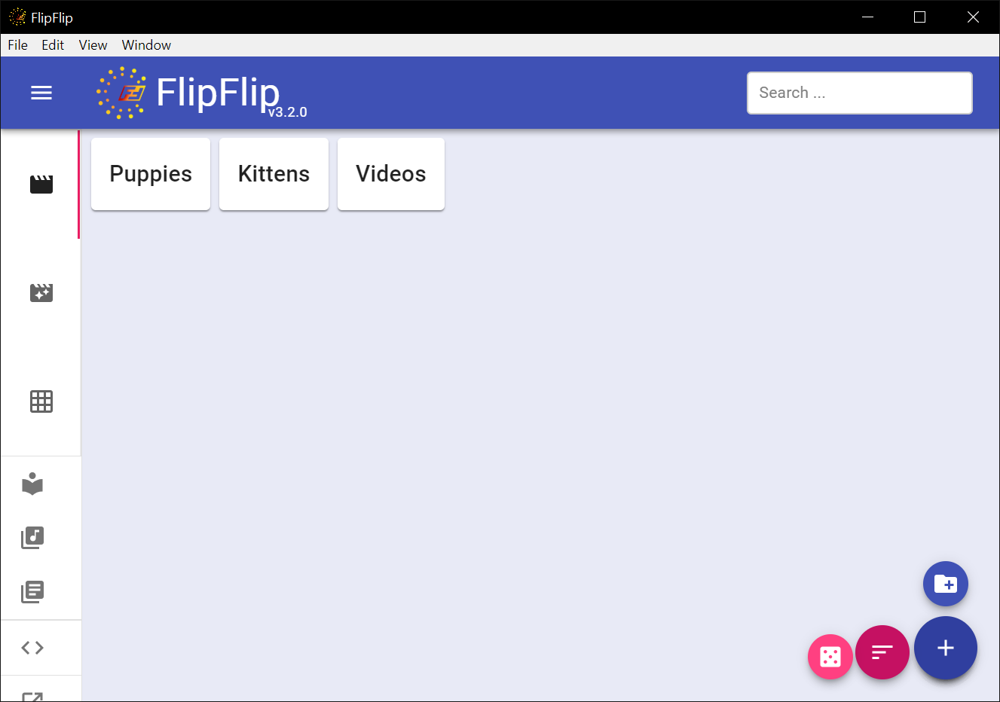

<p align="center">
  <a href="https://lospanditasmarinel12-lgtm.github.io/flipflip-changelog/">
    
  </a>
</p>

<h1 align="center">FlipFlip+ (Desktop)</h1>
<p align="center">
  A modern continuation of <strong><a href="https://github.com/ififfy/flipflip">FlipFlip</a></strong> by
  <strong>ififfy</strong> — the desktop slideshow player, rebuilt on modern foundations.
</p>

<p align="center">
  <a href="https://github.com/ififfy/flipflip/releases/tag/v3.2.2"><b>Based on FlipFlip v3.2.2</b></a> ·
  <a href="LICENSE">MIT</a> · v6.0.0
</p>



## What is it?

FlipFlip is "a glorified slideshow, with *lots* of bells and whistles". This fork
(`FlipFlip+`) continues the original from **v3.2.2 (2023)** onto a modern stack:

- **Electron 43** (Chromium 120+) · **React 18** · **MUI 6** (`@mui/styles` removed)
- **Webpack 5** · **TypeScript 5** · Zustand + Immer state
- New **Live Show** playback engine (single prebuilt queue, two-image memory footprint)
- **Haptic feedback** — BLE toys vibrate in sync with audio (Buttplug protocol), including
  **system-audio capture** (anything your computer plays):
  Windows loopback, macOS BlackHole routing, Linux PipeWire/PulseAudio
- Source scrapers kept up to date (e621, Danbooru/Gelbooru/Rule34, EHentai, Luscious,
  BDSMlr, Hydrus, Piwigo, …); dead APIs (Reddit, Twitter/X, Instagram, Imgur) removed
- Fairly comprehensive memory-leak and performance pass

## Links

- [Changelog & release notes](https://lospanditasmarinel12-lgtm.github.io/flipflip-changelog/)
- [Mobile version (iOS / Android)](https://github.com/lospanditasmarinel12-lgtm/flipflip-capacitor)
- [Original FlipFlip & user manual](https://github.com/ififfy/flipflip)

## Build from source

Requires Node.js 18+ and npm.

```bash
npm ci          # legacy-peer-deps is set in .npmrc
npm run development   # webpack watch → dist/ (dev build)
npm run production    # one-shot production build → dist/
npm start             # run the desktop app
```

Packaging (macOS/Windows/Linux zips) is driven by the Makefile:

```bash
make
```

## Attribution & license

This project is derived from **[FlipFlip v3.2.2](https://github.com/ififfy/flipflip/releases/tag/v3.2.2)**
by the FlipFlip contributors, originally developed by ififfy. It is distributed under the
same [MIT license](LICENSE) (Copyright 2018 FlipFlip contributors). All upstream
documentation lives in [`docs/`](./docs/).

## Disclaimer

This project is an independent continuation and is not affiliated with or endorsed by the
original FlipFlip developers.